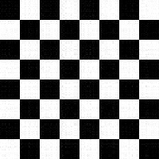
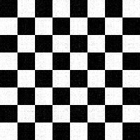

# NLA_Challenge2_SVD_IC

# Singular Value Decomposition and Image Compression

## 🎯 Project Mission & My Role
This project was a deep dive into one of the most powerful algorithms in numerical linear algebra: Singular Value Decomposition (SVD). Our mission, as part of the "Numerical Linear Algebra" course at Politecnico di Milano, was to move beyond theory and implement a practical, high-performance solution for a real-world application: image compression and denoising.

As the project lead, my role was to guide our team's strategy and ensure we built a robust and well-documented solution. I focused on architecting the overall workflow, from loading and processing images using the C++ Eigen library to comparing iterative solvers with the LIS library.

This README serves as a comprehensive technical report of our findings, demonstrating a first-principles understanding of SVD and its profound applications in high-performance scientific computing.

---
## 🤝 The Team
This project's success was a result of a talented and collaborative team effort, with invaluable guidance from our teaching staff.

## Contributors:

- [Hirdesh Kumar](https://www.linkedin.com/in/hirdeshkumar2407/)

- [Nadah Khaled](https://www.linkedin.com/in/nadahkhaledd10/)

- [Milica Sanjevic](https://www.linkedin.com/in/milica-sanjevic-321392327/)

## Guidance:
- **Professor [P. F. Antonietti](https://www.linkedin.com/in/paolaantonietti/?lipi=urn%3Ali%3Apage%3Ad_flagship3_search_srp_all%3BtoYfzDyNQUuaYhVlXkVXMQ%3D%3D)**

- **Teaching Assistant [Dott. M. Botti](https://www.linkedin.com/in/michele-botti-4707a62a2/?lipi=urn%3Ali%3Apage%3Ad_flagship3_search_srp_all%3BFvI80B0lRXiNyhRyRoR13Q%3D%3D)**


## 1. Singular Value Decomposition (SVD)

Singular Value Decomposition is a fundamental technique in linear algebra that factorizes a matrix into three matrices: U, Σ, and V^T. For any m × n matrix A:

A = UΣV^T

Where:
- U is an m × m orthogonal matrix
- Σ is an m × n rectangular diagonal matrix with nonnegative real numbers on the diagonal
- V^T is the transpose of an n × n orthogonal matrix

SVD has numerous applications, including image compression and noise reduction.

---

## 2. Image Compression Using SVD

SVD can be used for image compression by approximating the original matrix with a lower-rank matrix. This is done by keeping only the k largest singular values and their corresponding singular vectors:

A ≈ σ₁u₁v₁^T + σ₂u₂v₂^T + ... + σₖuₖvₖ^T

Where σᵢ are singular values, uᵢ are left singular vectors, and vᵢ are right singular vectors.

### Example: 4x4 Image Matrix

Let's walk through a simple example of SVD-based image compression using a 4x4 grayscale image matrix.

#### Step 1: Original Image Matrix A
```
A = [100  120  130  115]
    [105  125  135  120]
    [110  130  140  125]
    [115  135  145  130]
```

#### Step 2: Compute SVD
After computing SVD, we get U, Σ, and V^T matrices.

#### Step 3: Truncate SVD
For compression, we keep only the first k singular values and vectors. Let's say k = 2.

#### Step 4: Reconstruct Compressed Image
The compressed image is reconstructed using only the first two components:

A' ≈ σ₁u₁v₁^T + σ₂u₂v₂^T

#### Step 5: Resulting Compressed Image Matrix
```
A' ≈ [99   119  131  116]
     [104  124  136  121]
     [110  130  141  126]
     [115  135  146  131]
```

This compressed version approximates the original image while using less data.

---

## 3. Why Numerical Linear Algebra?

SVD and image processing involve complex matrix operations, making efficient numerical methods crucial. **Numerical linear algebra** provides the tools to perform these operations effectively. In this project, we use:

- **Eigen Library**: For matrix operations and SVD computation
- **LIS Library**: For iterative solvers in eigenvalue problems

---

## 4. C++ Implementation with Eigen and LIS

We use the **Eigen** and **LIS** libraries for matrix manipulation, SVD computation, and solving linear systems. Here's an overview of the key libraries and headers used:

```cpp
#include <Eigen/IterativeLinearSolvers> 
#include <cstring>
#include <iostream>
#include <sstream>
#include <cstdlib>
#include <tuple>
#include <utility>
#include <algorithm>
#include <fstream>
#include <cstdio>
#include <memory>
#include <stdexcept>
#include <string>
#include <cmath>
#include <array>
```

---

## 5. Task Descriptions

This project implements several tasks related to SVD and image processing:
   <ol>
        <li>
            Load the image as an Eigen matrix A with size m×n. Each entry in the matrix corresponds to a pixel on the screen and takes a value somewhere between 0 (black) and 255 (white). Compute the matrix product A<sup>T</sup>A and report the euclidean norm of A<sup>T</sup>A.
            <h5>Result:</h5>
         

    --------TASK 1----------
    Norm of A and A transpose: 1050410679
           
</li>
    <li>
            Solve the eigenvalue problem A<sup>T</sup>Ax = λx using the proper solver provided by the Eigen library. Report the two largest computed singular values of A.
        </li>
        <h5>Result:</h5>
         
      --------TASK 2----------
      The two largest singular values by Eigen library method are: 32339.1 and 9523.1

<li>
            Export matrix A<sup>T</sup>A in the matrix market format and move it to the lis-2.1.6/test folder. Using the proper iterative solver available in the LIS library compute the largest eigenvalue of A<sup>T</sup>A up to a tolerance of 10<sup>-8</sup>. Report the computed eigenvalue. Is the result in agreement with the one obtained in the previous point?

<h5>Result:</h5>
         
     --------TASK 3----------
     A and A transpose matrix successfully exported to ATA-product.mtx

     number of processes = 1
     matrix size = 256 x 256 (65536 nonzero entries)

     initial vector x      : all components set to 1
     precision             : double
     eigensolver           : Power  
     convergence condition : ||lx-(B^-1)Ax||_2 <= 1.0e-12 * ||lx||_2
     matrix storage format : CSR
     shift                 : 0.000000e+00
     eigensolver status    : normal end

     Power: mode number          = 0
     Power: eigenvalue           = 1.045818e+09
     Power: number of iterations = 12
     Power: elapsed time         = 8.506250e-04 sec.
     Power:   preconditioner     = 0.000000e+00 sec.
     Power:     matrix creation  = 0.000000e+00 sec.
     Power:   linear solver      = 0.000000e+00 sec.
     Power: relative residual    = 1.054313e-13

    The largest eigenvalue of the A and A transpose matrix product by LIS library method is: 1.04582e+09
    Sqaure Root Eigenvalue by LIS: 32339.1

    Single Value by Eigen library: 32339.1
    The two values are approximately equal.
</li>

<li>
            Find a shift μ ∈ R yielding an acceleration of the previous eigensolver. Report μ and the number of iterations required to achieve a tolerance of 10<sup>-8</sup>.
 
<h5>Result:</h5>
         
    --------TASK 4---------- 

    number of processes = 1
    matrix size = 256 x 256 (65536 nonzero entries)

    initial vector x      : all components set to 1
    precision             : double
    eigensolver           : Inverse
    convergence condition : ||lx-(B^-1)Ax||_2 <= 1.0e-12 * ||lx||_2
    matrix storage format : CSR
    shift                 : 1.045818e+09
    linear solver         : BiCG
    preconditioner        : none
    eigensolver status    : normal end

    Inverse: mode number          = 0
    Inverse: eigenvalue           = 1.045818e+09
    Inverse: number of iterations = 3
    Inverse: elapsed time         = 5.679960e-03 sec.
    Inverse:   preconditioner     = 6.991000e-06 sec.
    Inverse:     matrix creation  = 5.500000e-07 sec.
    Inverse:   linear solver      = 3.639893e-03 sec.
    Inverse: relative residual    = 3.545967e-14
           
</li>

<li>
            Using the SVD module of the Eigen library, perform a singular value decomposition of the matrix A. Report the Euclidean norm of the diagonal matrix Σ of the singular values.

            
</li>
   <h5>Result:</h5>
         
    --------TASK 5----------
    The Euclidean norm of the singular values is: 35576.6

<li>
            Compute the matrices C and D described in (1) assuming k = 40 and k = 80. Report the number of nonzero entries in the matrices C and D.
 </li>
       <h5>Result:</h5>
         
    --------TASK 6 ---------
    S dimensions: 256 x 1
    C dimensions: 341 x 40
    D dimensions: 256 x 40

    Non-zero elements of C with k= 40 are: 13640
    Non-zero elements of D with k= 40 are: 10240


    S dimensions: 256 x 1
    C dimensions: 341 x 80
    D dimensions: 256 x 80
    Non-zero elements of C with k= 80 are: 27280
    Non-zero elements of D with k= 80 are: 20480

 
 <li>
            Compute the compressed images as the matrix product CD<sup>T</sup> (again for k = 40 and k = 80). Export and upload the resulting images in .png.
</li>
       <h5>Result:</h5>
        
        
    --------TASK 7 ---------
    image created: results/compressedA40.png 

<br> </br>
                
       
    --------TASK 7 ---------
    image created: results/compressedA80.png 
 

<br> </br>


<li>
            Using Eigen create a black and white checkerboard image (as the one depicted below) with height and width equal to 200 pixels. Report the Euclidean norm of the matrix corresponding to the image.
</li>
   <h5>Result:</h5>
        
        
    --------TASK 8----------
    image created: results/checkerboard.png
    The norm of the checkerboard matrix is: 36062

<br> </br>

<li>
            Introduce a noise into the checkerboard image by adding random fluctuations of color ranging between [-50, 50] to each pixel. Export the resulting image in .png and upload it.
        </li>
   <h5>Result:</h5>
        
        
    --------TASK 9----------
    image created: results/noisy_image.png

<br> </br>
<li>
            Using the SVD module of the Eigen library, perform a singular value decomposition of the matrix corresponding to the noisy image. Report the two largest computed singular values.
        </li>

 <h5>Result:</h5>
         
    --------TASK 10----------
    The Euclidean norm of the singular values is: 36479.7
    The 2 largest singular values are:{25510.4, 25442.8}

<li>
            Starting from the previously computed SVD, create the matrices C and D defined in (1) assuming k = 5 and k = 10. Report the size of the matrices C and D.
        </li>


 <h5>Result:</h5>
         
    --------TASK 11----------
    S dimensions: 200 x 1
    C dimensions: 200 x 5
    D dimensions: 200 x 5

    Non-zero elements of C with k= 5 are: 1000
    Non-zero elements of D with k= 5 are: 1000
     
    S dimensions: 200 x 1
    C dimensions: 200 x 10
    D dimensions: 200 x 10
     

     Non-zero elements of C with k= 10 are: 2000
     Non-zero elements of D with k= 10 are: 2000

<li>
            Compute the compressed images as the matrix product CD<sup>T</sup> (again for k = 5 and k = 10). Export and upload the resulting images in .png.
        </li>
      
    --------TASK 12----------
    C dimensions: 200 x 5
    D dimensions: 5 x 200
    Compressed Image dimensions: 200 x 200
    image created: results/compressedCheckerBoard5.png

<br> </br>    

    --------TASK 12----------
    C dimensions: 200 x 10
    D dimensions: 10 x 200
    Compressed Image dimensions: 200 x 200
    image created: results/compressedCheckerBoard10.png

<br> </br>  

<li>
            Compare the compressed images with the original and noisy images. Comment the results.
        </li>
         <h5>Result:</h5>
         
    --------TASK 13----------
    Mean Square Error between original checkerboard and compressed checkerboard with k=5: 61.916
    Mean Square Error between original checkerboard and compressed checkerboard with k=10: 131.546
    Mean Square Error between original checkerboard and noisy checkerboard: 832.017

    From the results obtained, the checkerboard image follows two color scheme, lower Mean Square Error(MSE) calculations compared to the original: compressed images {k=5, MSE= 61.916},{k=10,131.546}, and noisy image{MSE= 832.017} better the image quality gets and more visually similar to the original with respect to compression and noise.
</ol>
---

## 6. Results and Analysis

(After completing the project, summarize key findings here, including:)
- Effectiveness of SVD in image compression
- Comparison of eigenvalue computation methods (Eigen vs. LIS)
- Analysis of noise reduction results
- Visual comparisons of original, compressed, and denoised images

---

## Conclusion

This project demonstrates the power of Singular Value Decomposition in image processing, particularly for compression and noise reduction. It showcases the practical application of numerical linear algebra techniques and the use of efficient libraries like Eigen and LIS for complex matrix operations.

---


